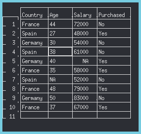

---
title: Preprocesamiento de Datos con R
author: Erick Lievana
date: \today
titlepage: true
table-use-row-colors: true
toc: true
toc-own-page: true
institute: Benemérita Universidad Autónoma de Puebla \newline Facultad de Ciencias de la Computacion
...
# Desarrollo
## Especificaciones del Sistema
Este trabajo se desarrollo en un sistema GNU/Linux con las siguientes características:

- OS: Arch Linux
- Kernel: Linux 5.16
- Versión de R: 4.1.2
- Display: X11

## Script

Para este trabajo se desarrollo un script, para poder ejecutar de manera mas facil los comandos necesarios para realizar el preprocesamiento de datos. El script realiza las siguientes acciones:

1. Verifica, y en caso de necesitarlo, instala y carga la libreria *readr*
2. Lee los datos desde el archivo *csv* y los carga a memoria
3. Muestra los datos
4. Reemplaza los datos faltantes de Edad y Salario usando la media
5. Muestra los datos completados
6. Codica los datos de país y compras, con etiquetas numericas
7. Muestra los datos codificados
8. Verifica, y en caso de necesitarlo, instala y carga la libreria *caTools*
9. Crea los grupos de entrenamiento y prueba a partir de los datos
10. Muestra los grupos de entrenamiento y prueba
11. Escala los grupos
12. Muestra los grupos escalados

Se anexa el script junto con el reporte a la plataforma.

## Ejecución
Para sistemas GNU/Linux, R puede ser ejecutado en un modo interactivo desde la terminal, con el comando:

    R

En este modo interactivo, se pueden ingresando 1 a 1 los comandos, similar a una sesión de python. De igual forma, se pueden crear scripts que se pueden ejecutar de manera interactiva desde el propio prompt de R con el comando(Esta es la forma en la que se ejecuto el script creado para esta practica):

    source("nombreScript.R")

Asi mismo se puede ejecutar el script de manera no interactiva, al ejecutar desde la linea de comandos del sistema, en este caso BASH, con ayuda del comando:

    Rscript nombreScript.R

Es importante notar que en dado caso que el script se encuentre en otro directorio, se necesitara añadir el camino relativo o el completo al nombre del script.

# Resultados
Lo primero que nos mostrara el script son los datos originales del csv, cargados en R.

{width=50%}

Despues como se menciono antes, el script tratara de completar la información faltante haciendo uso de las medias de las columnas de los datos faltantes. Por ejemplo en la columna de edad en la entrada 7, ahora se tiene la edad promedio del resto de la columna que es **38.77778**. Lo mismo sucede con el dato de salario faltante.

{width=50%}

De igual manera, se codifican los datos de las columnas de país y compra, asignando 1 para Francia, 2 para España y 3 para Alemania. Asi mismo se representa con 1 si se compro el producto o 0 si no se compro.

{width=50%}

Una vez codificada y completada la información se pueden generar los grupos de entrenamiento, estos se muestran directamente en la consola, en la sesión interactiva de R.

# Conclusiones
R es un lenguaje muy completo que presenta fallas, que si no son catastroficas, si son incovenientes. Un ejemplo de esto es la diferencias que existen en su modo interactivo y no interactivo, hay funciones como *readline* que solo funcionan en el modo interactivo, tambien parece ser que se ha recaido mucho en Rstudio como interfaz para el desarrollo en R, la ventana con las tablas creadas por la funcion *View*, por lo que alcance a investigar son imposibles de personalizar, ni siquiera hay una forma de agrandar la letra.

En cuestion a la minería de datos, comprendi el por que de la codificación de los datos, es mas facil trabajar con numeros a cadenas, sin embargo la forma de codificación se me hizo un poco propensa a errores, la codificación depende de que se escriban bien los datos, por lo que si el programador o un dato en la tabla estan equivocados, habra un grupo de datos que no se codificara, generando errores en los pasos posteriores.

Por otro lado la parte de la escalación si me es completamente confusa, por lo que debere investigar esa parte mas a fondo en practicas posteriores.
